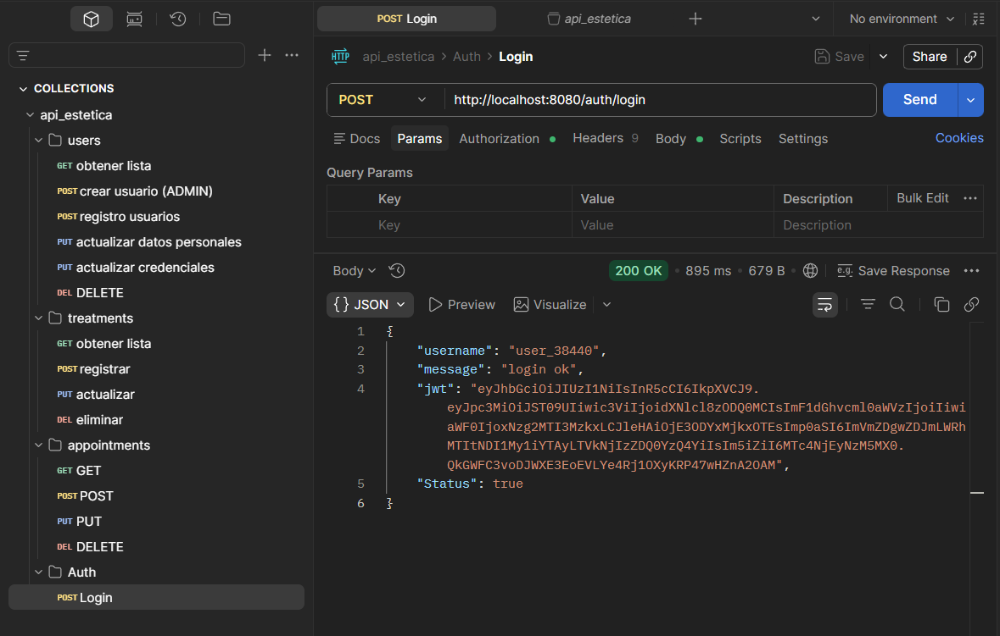
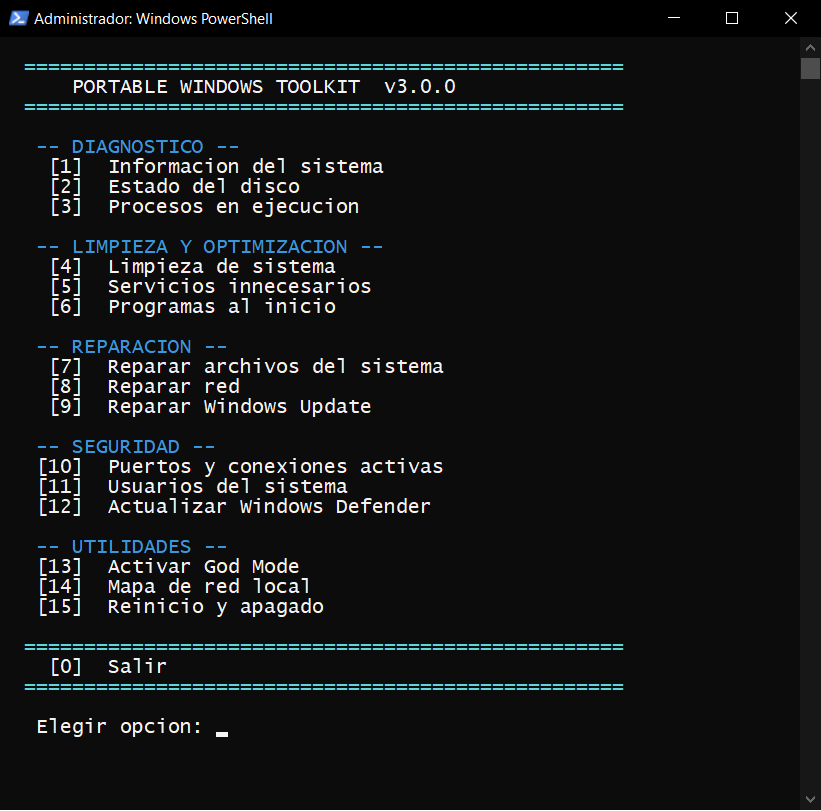
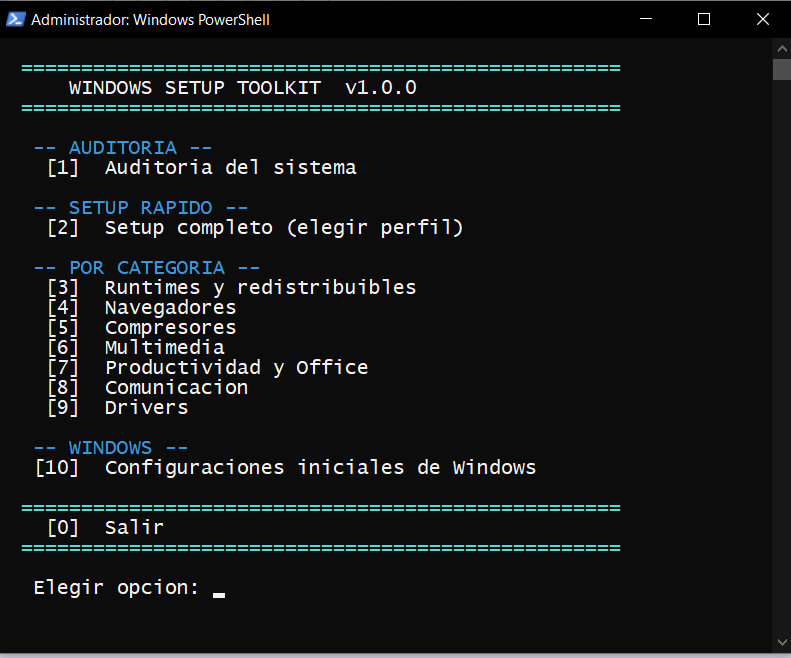

| 🔍 Rol Objetivo | 🛠️ Main Stack | 📍 Ubicación | ⚡ Especialidad |
| :--- | :--- | :--- | :--- |
| Soporte L2/L3 / Java Backend | Java, Spring Boot, PowerShell, Python | Berazategui, Buenos Aires | Automatización & APIs REST |

---

## 🛠️ Tecnologías y Herramientas

**Desarrollo Backend & Bases de Datos**  
    

**Automatización, Soporte & Sistemas**  
   

**Control de versiones & IDEs**  
  

---

## 📂 Proyectos destacados

  
🌐 <b>API REST - Gestión de Turnos (Java - Spring Boot)</b>

   

  <!-- Para agregar la imagen, subes la captura a la carpeta del proyecto en GitHub y reemplazas la URL de abajo -->
  

* **Descripción:** API REST desarrollada en Java con Spring Boot para la gestión de turnos y servicios.
* **Características:** Arquitectura por capas, persistencia de datos con MySQL/JPA, control de acceso mediante Spring Security y pruebas de endpoints con Postman.
* **Link al repositorio:** [api-estetica](https://github.com/devGonzaloCastellano/api-estetica)

  
⚙️ <b>Toolkit de Diagnóstico y Soporte Técnico (PowerShell)</b>

   

  

* **Descripción:** Herramientas de automatización para auditoría técnica de hardware/software, lectura de métricas del sistema y generación de reportes automáticos para diagnóstico de fallas.
* **Link al repositorio:** [toolkit-diagnostico-soporte](https://github.com/devGonzaloCastellano/toolkit-diagnostico-soporte)

  
📦 <b>Toolkit de Instalación y Configuración (PowerShell)</b>

   

  

* **Descripción:** Scripts orientados a la puesta en marcha rápida de equipos, automatizando el despliegue de aplicaciones, dependencias y runtimes esenciales.
* **Link al repositorio:** [toolkit-instalacion-configuracion](https://github.com/devGonzaloCastellano/toolkit-instalacion-configuracion)

---

## 📚 En constante aprendizaje

 

- **Conceptos:** Monitoreo de servicios y análisis de logs, pruebas avanzadas de APIs REST y buenas prácticas de arquitectura e infraestructura.

---

## 📫 Contacto

